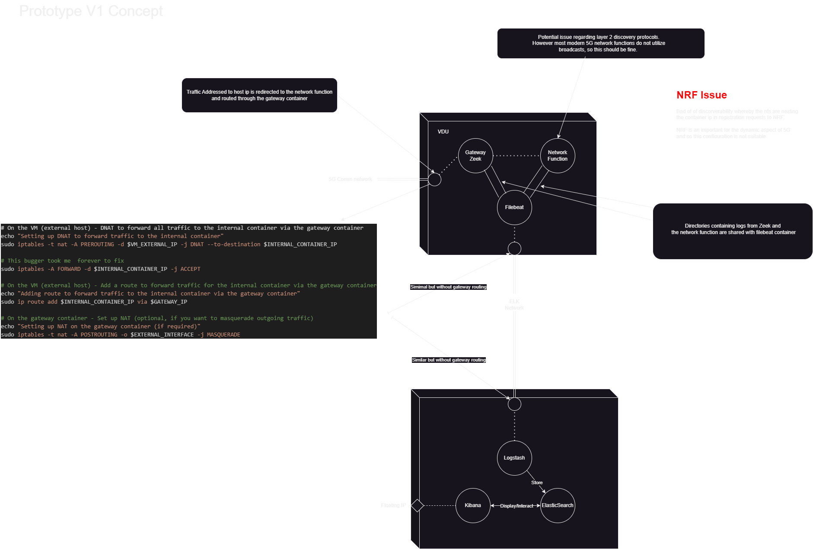
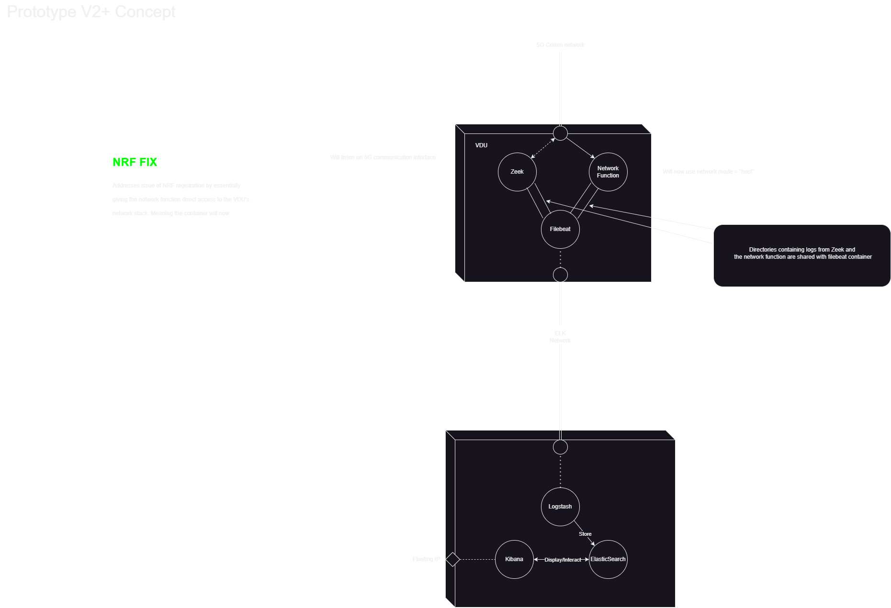
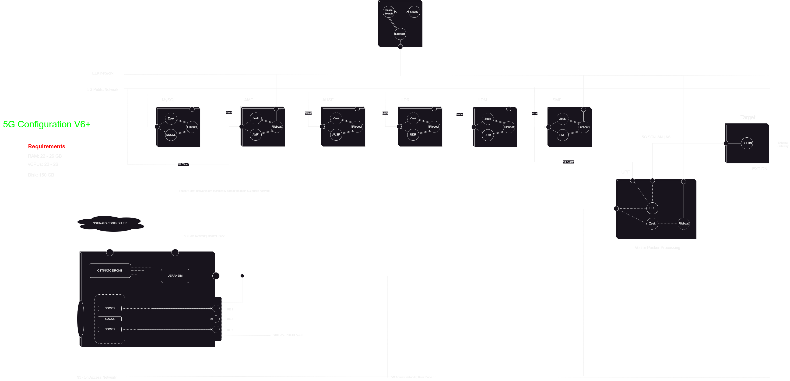
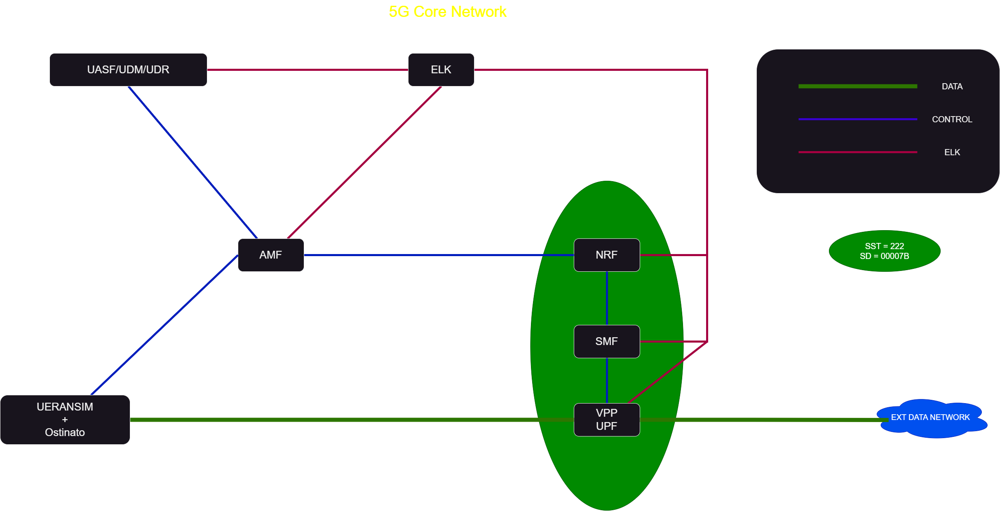
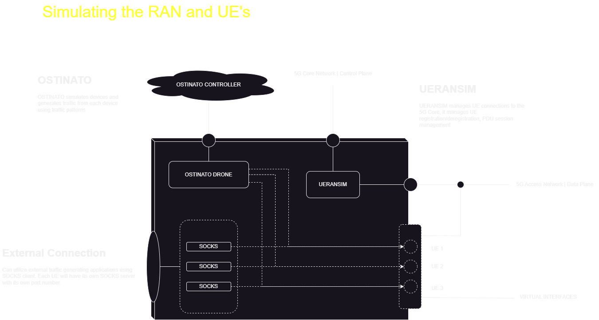

# Project Overview

Welcome to the Python Project! This repository contains various elements and files essential for the project's development and deployment.

## Directory Structure

Here is an overview of the main directories and files in this project:

### Directories

- **custom_elements**
    - Contains custom elements used in conjunction with disk image builder.

- **Diagrams**
    - Includes diagrams related to the project architecture and 5G ELK enabled NFV configuration.

- **docker**
    - Contains Docker configurations for vnf's and ELK

- **project_files**
    - General project files and resources.

- **Requests**
    - Handles HTTP requests and related functionalities.

- **VNFDs**
    - Virtual Network Function Descriptors used in the project.

## VNFDs Directory

The VNFDs (Virtual Network Function Descriptors) directory contains various VNFs (Virtual Network Functions) used in the project. Below is a list of the VNFs included:

- **ALL_IN_ONE_VNFD**
    - A comprehensive VNFD that includes all necessary functions in one descriptor.

- **AMF_VNFD**
    - VNFD for the Access and Mobility Management Function.

- **AUSF_VNFD**
    - VNFD for the Authentication Server Function.

- **ELK_VNFD**
    - VNFD for the ELK stack (Elasticsearch, Logstash, Kibana).

- **EXT_DN_VNFD**
    - VNFD for the External Data Network.

- **NRF_VNFD**
    - VNFD for the Network Repository Function.

- **SMF_VNFD**
    - VNFD for the Session Management Function.

- **SQL_VNFD**
    - VNFD for the SQL database.

- **UDM_VNFD**
    - VNFD for the User Data Management function.

- **UDR_VNFD**
    - VNFD for the User Data Repository.

- **UERANSIM_VNFD**
    - VNFD for the UE and RAN Simulator.

- **UPF_VNFD**
    - VNFD for the User Plane Function.

## NF + Zeek + filebeat intergration: Prototype V1 Concept

- NRF issue was causing issues with SMF/UPF discoverability

## NF + Zeek + filebeat intergration: Prototype V2+ Concept

- NRF issue was addressed using docker network host

## V6 5G Core Network + DFR: Prototype V6+ Configuration

## V6 5G Core Network + DFR: High Level View

## RAN and UE Simulation: Ostinato + UERANSIM

